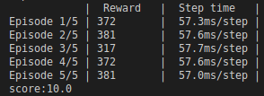
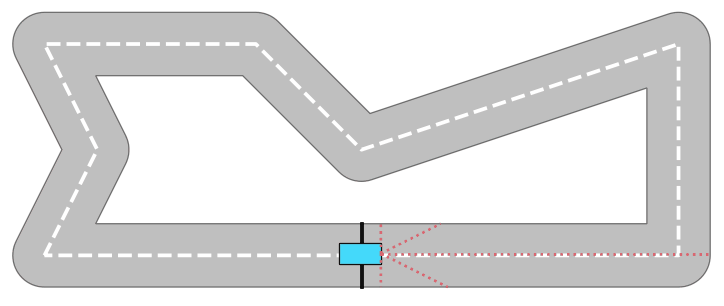

# Self-driving car with Reinforcement learning

### Rewards en circuit simple :


### Exemple de circuit :


Start by installing the requirements:
```
pip install -r requirements.txt
```

To train your any agent:
```
python -m carl.agents.tensorflow.<agent_name>
```

